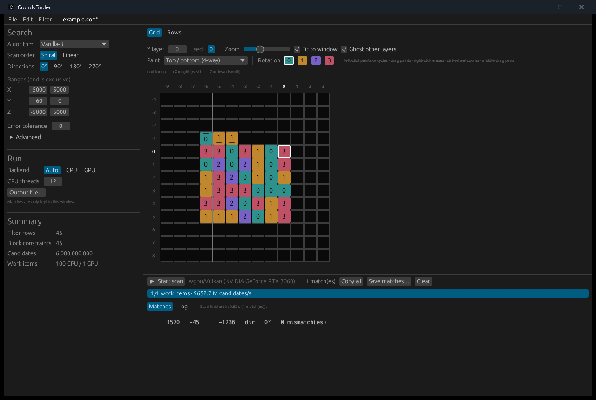
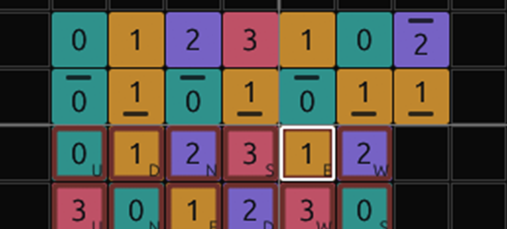
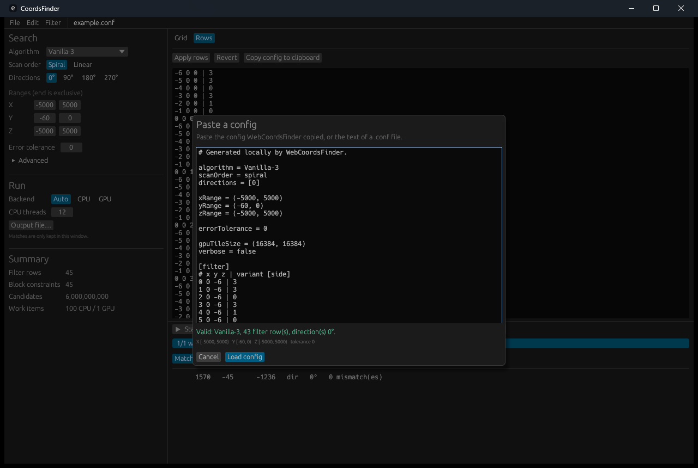
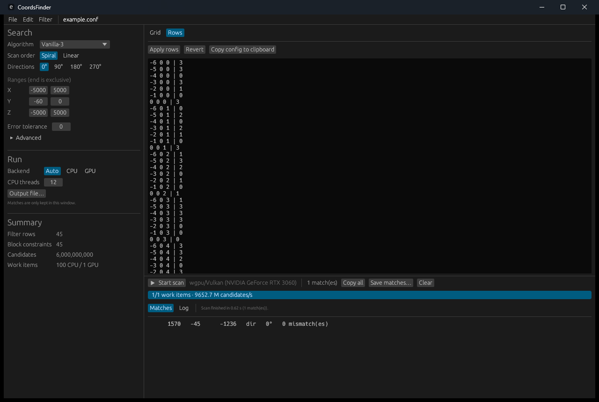

# CoordsFinder GUI guide

CoordsFinder GUI is a desktop front-end for the same search engine the
command-line tool uses. It edits a search config, validates it live, draws the
filter as a grid you can paint, and runs the scan in the window.

It does not reimplement anything. Configs are parsed by
`coordsfinder::config`, filters are compiled by `coordsfinder::filter`, and
scans run on `coordsfinder::cpu` or `coordsfinder::gpu`. A config saved from the
GUI is an ordinary `.conf` file, and a config written by hand or exported from
WebCoordsFinder opens in the GUI unchanged.

## Running it

```sh
cargo run --release -p coordsfinder-gui
cargo run --release -p coordsfinder-gui -- ./example.conf
```

The optional argument is a config to open at start, so the executable also works
as the "open with" target for `.conf` files. A config can also be dropped onto
the window, or pasted straight in with Ctrl+V — see
[Pasting a config](#pasting-a-config).

## Window layout



The same layout as a sketch, for reference:

```text
+-- menu ------------------------------------------------------------+
| File  Edit  Filter   example.conf  • unsaved                       |
+-- settings ----------+-- filter editor ----------------------------+
| Search               | [ Grid ] [ Rows ]                           |
|   Algorithm          |                                             |
|   Scan order         | Y layer  used: -1 0   Zoom  Fit to window   |
|   Directions         | Paint [Top / bottom (4-way)]  Rotation 0123 |
|   Ranges X / Y / Z   |                                             |
|   Error tolerance    |   north up, +X east right, +Z south down    |
|   Advanced           |     +---+---+---+---+---+                   |
|                      |     | 3 | 0 | 2 | 1 | 0 |                   |
| Run                  |     +---+---+---+---+---+                   |
|   Backend            |     | 1 | 3 |[3]| 0 | 1 |   [ ] = origin    |
|   CPU threads        |     +---+---+---+---+---+                   |
|   Output file        |                                             |
|                      |                                             |
| Summary              |                                             |
|   Filter rows        |                                             |
|   Block constraints  |                                             |
|   Candidates         |                                             |
|   Work items         |                                             |
+----------------------+---------------------------------------------+
| [ Start scan ]  wgpu/Vulkan (RTX 5080)   3 match(es)  Copy  Save    |
| [========================        ] 41/64 items, 155000 M cand/s     |
| [ Matches ] [ Log ]                                                 |
|   1570  -45  -1236   dir 0°   0 mismatch(es)                        |
+---------------------------------------------------------------------+
```

## Settings

Every setting maps to one config key, with the same meaning and the same
half-open `[start, end)` ranges described in the [README](../README.md).

| Control | Config key |
| --- | --- |
| Algorithm | `algorithm` |
| Scan order | `scanOrder` |
| Directions | `directions` |
| Ranges X / Y / Z | `xRange`, `yRange`, `zRange` |
| Error tolerance | `errorTolerance` |
| Advanced → CPU tile, GPU tile, Verbose | `cpuTileSize`, `gpuTileSize`, `verbose` |

Backend, CPU threads, and the output file are run options rather than config
settings; they match the `--backend`, `--threads`, and `--output` flags.

## Summary and validation

The Summary block re-validates after every edit by writing the document out as
config text and parsing it back with the real parser. It reports:

- **Filter rows** — configured observations.
- **Block constraints** — rows after same-block rows are merged, which is what
  the scanner actually checks.
- **Candidates** — coordinates the plan will test.
- **Work items** — tiles for the CPU and GPU tile sizes.

If the document is not valid, the block shows the parser's own error message and
the Start button stays disabled. Forced-error warnings from filter preparation
appear here too, in amber.

## The grid editor

The grid shows one Y layer in Minecraft's top-down map orientation: `+X` runs
right (east), `+Z` runs down (south), so north is up. The origin — the candidate
coordinate the offsets are relative to — is the outlined cell at `0, 0`.

### Reading a cell



A painted cell shows its rotation twice: as the **digit** that will be written
to the config, and as a **colour**, matching the swatches on the Rotation
buttons.

What the colour and digit cannot say is which *face* a row is, so that is what
the remaining marks are for:

- A `side` row gets a **bar** — at the top for `0`, at the bottom for `1`. A
  `side` value is a two-state mirror rather than a turn, and the bar is what
  separates the two at a glance. The bar appears whenever the block carries a
  side row, including on a block that also has a top face — which is the usual
  case for stone, where you can see both.
- A netherrack row gets a **ring** around the cell, in netherrack's own red.
  Netherrack uses a different model selector from ordinary blocks and can never
  share a block with them, so the family is worth seeing without reading
  anything. The red is taken darker than the block's texture so it keeps its
  contrast against every rotation colour, including rotation 3, which is itself
  a red.
- A **badge** names which netherrack face a row is — a compass letter, `U` and
  `D` for up and down. Only netherrack rows get one: a side row is marked by its
  bar instead, so no `S` for "side" ever sits next to an `S` for "south".

That leaves each family with one cue of its own:

| Cell | Family |
| --- | --- |
| Colour and digit only | Top or bottom face of an ordinary rotated block |
| A bar | `side` — side face of a mirrored block |
| A red ring and a letter | `netherrack-up`, `-down`, `-north`, `-south`, `-east`, `-west` |

A netherrack block holding several faces shows every letter, and hovering any
cell lists its rows in full.

When cells get small the **digit is dropped first and the badge grows into the
middle**, because the colour already carries the rotation while nothing else
carries the face. The automatic fit never shrinks cells past the point where
digits still fit, so this only happens after zooming out by hand.

Cells painted on *other* Y layers show through faintly in their own rotation
colour, so a structure can be traced across layers; a painted cell that also has
rows elsewhere gets a dot in its top-left corner.

The board is ruled with a heavier line every five cells and a brighter one on
the `x = 0` and `z = 0` axes, and hovering lights up a band down the row and
column with their coordinates, so an offset can be read off without counting
squares.

### Editing

- **Left-click** paints the selected brush and rotation. Clicking a cell that
  already holds exactly that advances the rotation, so repeated clicks cycle
  `0 → 1 → 2 → 3`.
- **Drag** paints without cycling.
- **Right-click** erases every row at that cell.
- **Ctrl+Z** undoes, **Ctrl+Y** redoes; a whole stroke undoes at once. See
  [Undo and redo](#undo-and-redo).
- **Ctrl+wheel** zooms, keeping the cell under the pointer in place;
  **middle-drag** pans. The Zoom slider does the same thing. Either turns *Fit
  to window* off, since both are a request for a particular size.
- **Y layer** switches layers; the numbers next to it are the layers already in
  use.
- **Fit to window** sizes the board to the space it has, keeping three empty
  cells around the filter to extend into. It never shrinks cells past the point
  where their digits stay readable — a filter too big for the window scrolls
  instead of becoming illegible. Zooming by hand can go smaller than that, for
  an overview of a large filter.

## Undo and redo

**Ctrl+Z** steps back, **Ctrl+Y** or **Ctrl+Shift+Z** steps forward, and both
are in the **Edit** menu, greyed out when there is nothing to step to.

Undo covers the whole document — filter rows and settings alike — so undoing
after dragging a range value puts the range back just as it puts a painted cell
back.

**One gesture is one step.** A stroke painting twenty cells with the button held
undoes as a single action, as does a drag that took a range value through fifty
intermediate numbers. A burst of edits stays open while the pointer is down and
closes when it is released, so separate clicks stay separate steps.

Two things it deliberately does not do:

- **Loading a document clears the history.** Undoing across an Open, a paste, or
  a New into the previous document's edits would be more surprising than useful.
- **It does not reach into text boxes.** While the rows editor or the paste box
  has focus, Ctrl+Z is that box's own undo, which is what you want while typing.
  Click away from it and Ctrl+Z is the document's again.

Undoing back to the state you last saved clears the *unsaved* marker in the
title, and saving does not cost you your history.

One Minecraft block cannot use both model selectors, so painting a netherrack
face over ordinary rows — or the reverse — clears the rows it cannot coexist
with. This is the same rule the config parser enforces; the editor applies it up
front rather than letting it surface as a validation error.

## Pasting a config

WebCoordsFinder offers its config on the clipboard as well as as a file, so a
config never has to be saved to disk just to get it in here.



**Press Ctrl+V anywhere in the window** — or use **File → Paste config…**
(Ctrl+Shift+V) and paste into the box. Either way the dialog validates the text
as it arrives and reports what it found: algorithm, filter row count,
directions, ranges, and tolerance. **Load config** stays disabled until the text
parses, and shows the parser's own error until then.

A pasted config has no file behind it, so the window keeps it as
`untitled.conf` and marks it unsaved. Save it if you want to keep it.

The reverse trip is **File → Copy config**, which puts the whole document on the
clipboard.

A plain Ctrl+V is only treated as a config when no text box has focus, so
pasting into the rows editor or into the paste dialog itself still works
normally.

## The rows editor



The **Rows** tab is the same filter as text, one `x y z | variant [marker]` row
per line. **Apply rows** parses the text with the settings currently in the
Search panel and replaces the filter; a bad row is reported without changing
anything. **Copy config to clipboard** copies the whole document, which is handy
for pasting into an issue or a Colab notebook.

Switching to the tab refreshes the text from the grid, so the two views never
disagree.

## Running a scan

Start disables config editing and runs the scan on a worker thread; the window
stays responsive. The progress bar shows completed work items, the live
candidate rate, and a rough time remaining. Stop asks the scan to stop — the CPU
backend checks between X/Z columns, the GPU backend after its current tile, so a
large tile can take a moment to wind down.

Matches stream into the Matches tab as they are found. Click a row to copy its
coordinates, or use Copy all / Save matches. Setting an output file first
appends every match to it as the CLI's `--output` does, which is the safer
choice for a long scan: the match list in the window stops growing after 50,000
entries, while the file keeps every one.

Closing the window cancels and waits for a running scan rather than leaving it
on a detached thread.

## Source layout

| File | What it does |
| --- | --- |
| `coordsfinder-gui/src/main.rs` | Window setup and the optional config argument |
| `coordsfinder-gui/src/app.rs` | Application state, validation cache, scan lifecycle |
| `coordsfinder-gui/src/ui.rs` | Panels and widgets |
| `coordsfinder-gui/src/grid.rs` | The click-to-paint grid |
| `coordsfinder-gui/src/model.rs` | Editable config, `.conf` writing, filter editing |
| `coordsfinder-gui/src/history.rs` | Undo and redo snapshots, and edit-burst grouping |
| `coordsfinder-gui/src/runner.rs` | Worker thread, progress channel, cancellation |

The GUI holds an `EditableConfig` rather than a `ScanConfig`, because a document
being edited is allowed to be temporarily invalid. `EditableConfig::to_conf_text`
writes config text and `to_scan_config` parses it back, so validation, saving,
and scanning all go through one code path and cannot drift apart.
